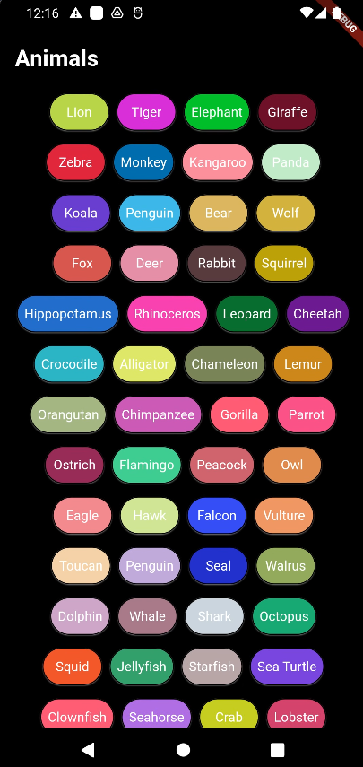

# Dynamic Row Grid

DynamicRowGrid is a highly customizable and flexible Flutter package designed to create dynamic, responsive grids of items with ease. It offers a wide range of configuration options to meet various UI needs, making it an ideal choice for developers looking to create visually appealing and functionally robust grid layouts in their applications.



## Features

- Flexible Item Count: Dynamically configure the number of items per row using the crossAxisCount property.
- Custom Item Builder: Use a custom itemBuilder function to generate each item in the grid, providing maximum flexibility in item rendering.
- Spacing Control: Easily adjust horizontal and vertical spacing between items with horizontalSpacing and verticalSpacing.
- Custom Alignment: Align items within each row using the alignment property, supporting various alignment options.
- Padding and Margins: Customize padding around the grid and margins between rows to fit your design needs.
- Scrollable Grid: Utilize scrollable grids with custom scroll physics and controllers.
- Shrink-Wrap Support: Enable or disable shrink-wrap behavior to optimize performance based on your layout requirements.
- Custom Row and Grid Decorations: Apply custom decorations to rows and the entire grid using rowDecoration and gridDecoration.
- Header and Footer: Add optional header and footer widgets to the grid for additional context or functionality.
- Empty State Handling: Display a custom widget when the grid is empty using the emptyStateWidget property.

## Getting started

1. Install the Package: Add dynamic_row_grid to your pubspec.yaml dependencies.

   ```yaml
   dependencies:
     dynamic_row_grid: ^0.0.1
   ```

2. Import the Package: Include the package in your Dart code with import 'package:dynamic_row_grid/dynamic_row_grid.dart';.

   ```dart
   import 'package:dynamic_row_grid/dynamic_row_grid.dart';
   ```

3. Use the Widget: Integrate the DynamicRowGrid widget into your layout and customize it as needed.

## Usage

Customizable Properties in DynamicRowGrid

- itemCount
- itemBuilder
- crossAxisCount
- horizontalSpacing
- verticalSpacing
- alignment
- physics
- controller
- shrinkWrap
- padding
- rowDecoration
- gridDecoration
- header
- footer
- emptyStateWidget

<hr>

```dart
final List animals = [
  'Lion',
  'Tiger',
  'Elephant',
  'Giraffe',
  ...
];

class MyApp extends StatelessWidget {
  const MyApp({super.key});

  @override
  Widget build(BuildContext context) {
    return MaterialApp(
      title: 'Flutter Demo',
      theme: ThemeData(
        colorScheme: ColorScheme.fromSeed(seedColor: Colors.deepPurple),
        useMaterial3: true,
      ),
      home: Scaffold(
        backgroundColor: Colors.black,
        body: DynamicRowGrid(
          itemCount: animals.length,
          crossAxisCount: 4,
          physics: const BouncingScrollPhysics(),
          header: const Padding(
            padding: EdgeInsets.all(16.0),
            child: Text(
              'Animals',
              style: TextStyle(
                  color: Colors.white,
                  fontSize: 24,
                  fontWeight: FontWeight.bold),
            ),
          ),
          footer: const Padding(
            padding: EdgeInsets.all(16.0),
            child: Text(
              'Footer',
              style: TextStyle(
                  color: Colors.white,
                  fontSize: 24,
                  fontWeight: FontWeight.bold),
            ),
          ),
          emptyStateWidget: const Center(
            child: Text(
              'No animals available',
              style: TextStyle(
                  color: Colors.white,
                  fontSize: 18,
                  fontWeight: FontWeight.bold),
            ),
          ),
          itemBuilder: (context, index) {
            return ElevatedButton(
              style: ButtonStyle(
                padding: MaterialStateProperty.all(
                  const EdgeInsets.symmetric(
                    horizontal: 8,
                    vertical: 3,
                  ),
                ),
                backgroundColor: MaterialStateProperty.all(
                  Color.fromARGB(
                    255,
                    Random().nextInt(256),
                    Random().nextInt(256),
                    Random().nextInt(256),
                  ),
                ),
                shape: MaterialStateProperty.all(
                  RoundedRectangleBorder(
                    borderRadius: BorderRadius.circular(30.0),
                    side: const BorderSide(width: 1, color: Colors.black),
                  ),
                ),
                shadowColor: MaterialStateProperty.all(
                  Colors.white,
                ),
              ),
              onPressed: () {},
              child: Text(
                animals[index],
                overflow: TextOverflow.ellipsis,
                style: const TextStyle(
                  fontSize: 14,
                  color: Colors.white,
                  fontWeight: FontWeight.w400,
                ),
              ),
            );
          },
        ),
      ),
    );
  }
}
```

<video autoplay loop muted width="600">
  <source src="screenshot/grid.webm" type="video/webm">
  Your browser does not support the video tag.
</video>
